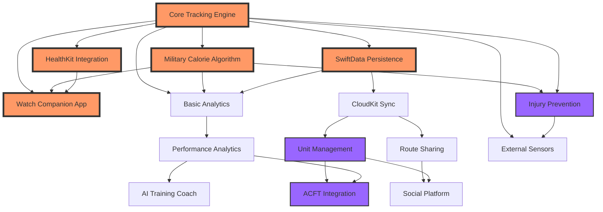

# RuckMap Feature Roadmap & Dependencies

## Feature Dependency Graph



## Release Timeline

### 🚀 MVP Release (Months 0-3)
**Target**: App Store Launch with Core Features

#### Month 1: Foundation
- [x] Week 1-2: Core tracking engine development
- [x] Week 3-4: SwiftData models and persistence

#### Month 2: Algorithm & Integration
- [ ] Week 5-6: Military calorie algorithm implementation
- [ ] Week 7-8: HealthKit and Watch app basics

#### Month 3: Polish & Launch
- [ ] Week 9-10: UI/UX refinement and testing
- [ ] Week 11-12: Beta testing and App Store submission

### 📈 Phase 2: Differentiation (Months 3-6)
**Target**: Military Market Penetration

#### Month 4: Unit Features
- [ ] CloudKit integration
- [ ] Basic unit management
- [ ] Group training sessions

#### Month 5: Military Integration
- [ ] ACFT test protocols
- [ ] Performance predictions
- [ ] Unit reporting

#### Month 6: Injury Prevention
- [ ] Biomechanical analysis
- [ ] Risk assessment
- [ ] Recovery protocols

### 🎯 Phase 3: Market Leadership (Months 6-12)
**Target**: Category Definition

#### Months 7-8: Intelligence Layer
- [ ] AI coaching foundation
- [ ] Advanced route intelligence
- [ ] Predictive analytics

#### Months 9-10: Community
- [ ] Social features
- [ ] Route marketplace
- [ ] Challenge system

#### Months 11-12: Innovation
- [ ] External sensor support
- [ ] Advanced biomechanics
- [ ] Research partnerships

## Feature Priority Matrix

```
Impact vs Effort Matrix

High Impact ↑
            │ Quick Wins          │ Major Projects
            │ • Basic Analytics   │ • Military Algorithm
            │ • HealthKit         │ • Unit Management  
            │ • Route Recording   │ • Injury Prevention
            │                     │ • AI Coach
    ────────┼─────────────────────┼────────────────────
            │ Fill-ins            │ Question Marks
            │ • Themes            │ • Social Features
            │ • Gear Tracking     │ • Sensor Integration
            │ • Nutrition         │ • Video Analysis
Low Impact  │                     │
            └─────────────────────┴────────────────────→
              Low Effort            High Effort
```

## Technical Implementation Phases

### Phase 1: Local-First Architecture
```swift
Core Technologies:
- SwiftData for persistence
- Core Location for GPS
- HealthKit for biometrics
- Swift Charts for analytics
- MapKit for route display
```

### Phase 2: Cloud Integration
```swift
Additional Technologies:
- CloudKit for sync
- Push Notifications
- Background Processing
- SharePlay for group sessions
```

### Phase 3: Intelligence Layer
```swift
Advanced Technologies:
- Core ML for predictions
- Vision for form analysis
- Natural Language for coaching
- ARKit for route preview
```

## Risk Mitigation Timeline

### Technical Risks by Phase

#### MVP Risks (High Priority)
1. **GPS Battery Drain**
   - Mitigation: Implement by Week 4
   - Fallback: Reduced sampling modes

2. **Calorie Algorithm Accuracy**
   - Mitigation: Lab validation by Week 8
   - Fallback: Conservative estimates

#### Phase 2 Risks (Medium Priority)
3. **CloudKit Sync Conflicts**
   - Mitigation: Design by Month 4
   - Fallback: Manual conflict resolution

4. **Unit Scale Performance**
   - Mitigation: Load testing by Month 5
   - Fallback: Unit size limits

#### Phase 3 Risks (Low Priority)
5. **ML Model Accuracy**
   - Mitigation: Continuous learning
   - Fallback: Rule-based systems

## Success Criteria Checkpoints

### MVP Launch Criteria
- [ ] < 8% calorie error in lab testing
- [ ] < 0.1% crash rate in beta
- [ ] 4.5+ star beta feedback
- [ ] < 10% battery/hour usage
- [ ] 99%+ sync reliability

### 6-Month Success Metrics
- [ ] 10,000+ monthly active users
- [ ] 100+ active military units
- [ ] 50%+ monthly retention
- [ ] 4.6+ App Store rating
- [ ] 15% injury reduction reported

### 12-Month Vision Goals
- [ ] Category leader in military fitness
- [ ] 50,000+ monthly active users
- [ ] Platform for research studies
- [ ] International military adoption
- [ ] Profitable without compromising mission

## Development Resource Allocation

### Team Composition Needs
1. **MVP (Months 1-3)**
   - 1 Senior iOS Developer (You)
   - 1 UI/UX Designer (Contract)
   - 1 QA Tester (Part-time)

2. **Growth (Months 4-6)**
   - +1 iOS Developer
   - +1 Backend Developer (CloudKit)
   - +1 Data Scientist (Algorithm)

3. **Scale (Months 7-12)**
   - +1 ML Engineer
   - +1 Community Manager
   - +1 Military Liaison

## Go-to-Market Alignment

### MVP Launch Strategy
- Beta test with local military units
- Focus on accuracy over features
- Build trust through transparency

### Growth Strategy
- Military base partnerships
- Unit subscription model
- Influencer partnerships (military fitness)

### Market Leadership
- Research publication partnerships
- Integration with military systems
- International expansion

This roadmap provides clear dependencies, timelines, and success criteria while maintaining flexibility for market feedback and technical discoveries.